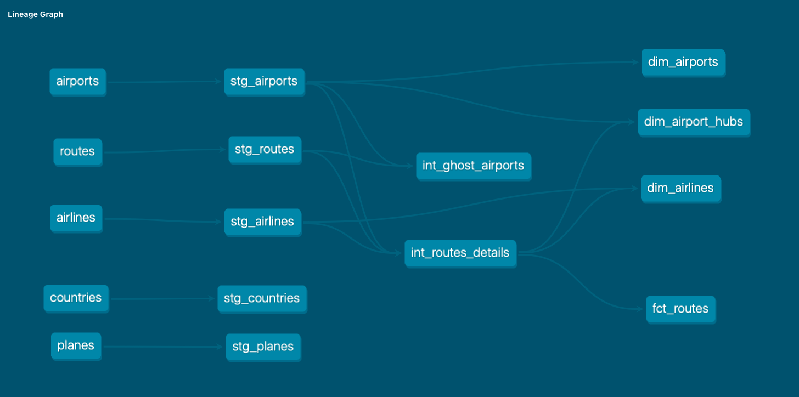

# ✈️ OpenFlights Data Pipeline

This project is a modern analytics engineering pipeline that transforms raw OpenFlights data into a clean, star-schema model ready for BI.

I built this to demonstrate a full Architecture using dbt, DuckDB, and GitHub Actions.

## 🏗️ Data Architecture
The project is structured into three distinct layers to ensure data reliability and clear lineage:

### 1. Staging Layer (`stg_`): Raw CSV ingestion. 
This layer handles the "ugly" parts of the OpenFlights data, such as converting \N strings to actual SQL NULLs and casting IDs to proper integers.

### 2. Intermediate (`int_`): This is where the heavy lifting happens. 
I join routes with airports and airlines and handle "Ghost Airports" (routes that point to airport IDs not present in the master airport list).

### 3. Marts Layer (`dim_` & `fct_`): The final Gold layer.
- Surrogate Keys: I used dbt_utils.generate_surrogate_key to create persistent, hashed IDs for airports, airlines, and routes.
- Feature Engineering: Added business logic like airport_category (Global Hub vs. Regional) and hemisphere classification.

## 🧩 Data Lineage
Below is the dbt-generated DAG (Directed Acyclic Graph) highlighting the Medallion architecture and the dependencies between our staging, intermediate, and marts layers. 

## 🚦 Data Quality Tests
This project implements a rigorous testing suite:
- Referential Integrity: Every route in fct_routes is tested to ensure it points to a valid airline and airport.
- Value Constraints: Latitude/Longitude are validated to stay within global bounds (-90/90 and -180/180).
- Custom Severity: Non-critical fields (like aircraft IATA codes) are set to warn, while primary keys are set to error to block the pipeline if duplicates appear.

## 🚀 CI/CD Pipeline
Every time code is pushed to this repo, a GitHub Action triggers a CI job.
It spins up a fresh environment, installs the dependencies, loads the seeds, and runs dbt build --select models/staging. This ensures that any change I make doesn't break the foundation of the project.

